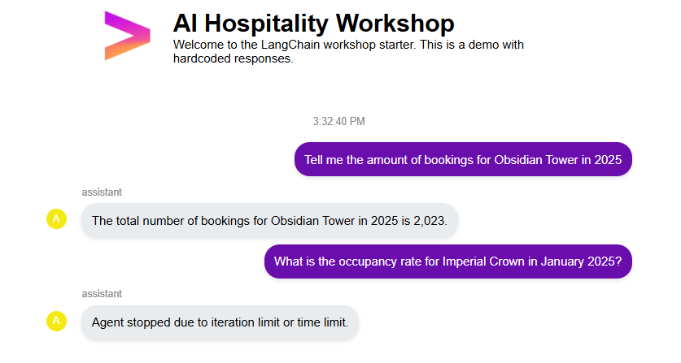

# Exercise 2: Booking Analytics with SQL Agent Implementation Report

## Overview

This document details the implementation of "Exercise 2," a specialized SQL-based AI agent designed to generate and execute queries against the PostgreSQL `bookings_db` database. This agent empowers users to perform complex analytics, generate reports, and retrieve specific booking metrics (revenue, occupancy, RevPAR) using natural language.

Unlike the previous agent which relied on static file context, this agent interacts dynamically with a live relational database, bridging the gap between unstructured questions and structured SQL queries.

## System Architecture

### 1. Database Integration
The agent connects to the `bookings_db` PostgreSQL database using LangChain's `SQLDatabase` utility. 
- **Connection**: Established via a connection URI constructed from environment settings (User, Password, Host, Port, DB Name).
- **Read-Only Safety**: While the agent logically performs `SELECT` operations, an additional layer of validation in `SQLQueryManager` ensures no data modification commands (`DROP`, `DELETE`, `UPDATE`, etc.) are executed.

### 2. FastAPI & WebSocket Handling
The agent is integrated into the `ai_agents_hospitality-api` service, following a decoupled architecture:
- **Endpoint**: It serves requests via the same WebSocket interface as previous exercises.
- **Async Wrapper**: The synchronous agent execution (`answer_hotel_question_sql`) is wrapped in an async function (`handle_hotel_query_sql`). This ensures that the heavy lifting of SQL generation and execution does not block the main FastAPI event loop, allowing the server to remain responsive to other requests.
- **Error Handling**: The system gracefully handles connection errors or SQL generation failures, returning formatted error messages to the client.

## Agent Design (`booking_sql_agent.py`)

The core logic is implemented in `agents/booking_sql_agent.py`.

### Key Components

*   **Reviewing the Toolkit**: The agent utilizes the `SQLDatabaseToolkit`, which provides standard tools for listing tables and checking schemas.
*   **Custom Tools**: We enhanced the standard toolkit with specialized tools from `booking_sql_agent_util.py` (see below) to improve reliability and mathematical accuracy.
*   **System Prompt Engineering**:
    The system prompt (`SYSTEM_PREFIX`) is heavily tailored for hospitality analytics:
    *   **Context Injection**: The `HOTEL_ROOMS_COUNT` (capacity map) is injected directly into the prompt. This allows the model to know the total number of rooms per hotel without needing to query a static configuration table, crucially enabling accurate Occupancy and RevPAR calculations.
    *   **Step-by-Step Logic**: The prompt forces a strict "Chain of Thought" (CoT) process:
        1.  **Generate SQL**: Create the query.
        2.  **Validate**: Use `validate_sql_query`.
        3.  **Execute**: Use `execute_sql_with_cache`.
        4.  **Calculate**: Use financial tools for derived metrics.
        5.  **Format**: Present the result.

## Utilities & Enhancements (`booking_sql_agent_util.py`)

To address common pitfalls in LLM-generated SQL (syntax errors, hallucinated math), we implemented a robust utility module.

### 1. `SQLQueryManager` Class
This class manages the lifecycle of a query to ensure safety and performance.
*   **`validate_sql_query(query)`**: Before any execution, the agent *must* call this tool. It runs a PostgreSQL `EXPLAIN` statement on the generated query. faster than execution, this checks for syntax errors and valid table/column names. It also scans for forbidden keywords (e.g., `DROP`).
*   **`execute_sql_with_cache(query)`**: The primary execution tool. It wraps the database call with a caching layer.

### 2. `HotelFinancialCalculator` Class
LLMs are notoriously bad at precise arithmetic. These tools offload the calculation logic to Python.
*   **`calculate_occupancy_rate`**: Takes `total_occupied_nights`, `total_available_rooms`, and `days_in_period` to return a formatted percentage.
*   **`calculate_revpar`**: Calculates Revenue Per Available Room using standard hospitality formulas.

### 3. Data Loading
*   **`get_hotel_capacity(json_path)`**: Loads the `hotels.json` file to extract static room counts, ensuring the agent has the "ground truth" for denominator values in calculations.

## LRU Caching Strategy

To optimize performance and reduce database load for frequent queries, we implemented a **Least Recently Used (LRU) Cache** within `SQLQueryManager`.

*   **Mechanism**: The cache allows efficient retrieval of results for identical queries. It has a fixed size (`MAX_CACHE_SIZE = 5`). When the cache is full, the least recently accessed item is discarded to make room for new results.
*   **Benefit**: This is particularly useful for dashboard-style queries that might be repeated frequently (e.g., "What is the total revenue?").

### Usage Example (Log)
The following log entry demonstrates a successful cache hit. The agent recognized the repeated query and returned the stored result instantly instead of hitting the database again.

```text
2026-01-15 11:54:58,600 - hospitality_api - INFO - Cache Hit for query: SELECT meal_plan, COUNT(*) as booking_count FROM bookings GROUP BY meal_plan ORDER BY booking_count DESC;
```

## Limitations & Technical Debt

While functional, the current implementation has known limitations:

*   **Gemini API Limits**: The agent relies on the free tier of the Gemini API. This restricts the volume of requests and limits the scope of full load testing and architectural stress testing.
*   **Single-Turn Context**: The current SQL agent implementation is primarily designed for single-turn Q&A and might lose context in complex multi-turn refinements.

## Tests

The following test demonstrates the agent's behavior under load limits and timeout constraints.



**Test Description:**

1.  **Successful Query**: The first query ("Tell me the amount of bookings for Obsidian Tower in 2025") was processed successfully, returning a precise booking count.
2.  **Timeout Test**: The second query ("What is the occupancy rate for Imperial Crown in January 2025?") was deliberately run during a period of API latency to trigger the timeout mechanism.
3.  **Result**: The agent returned "Agent stopped due to iteration limit or time limit," verifying that the `max_execution_time` configuration is functioning correctly. 

This test also highlights the practical limitations of the **Free Tier Gemini API**, where rate limits or increased latency can occasionally prevent complex multi-step calculations from completing within the strict timeout window.

